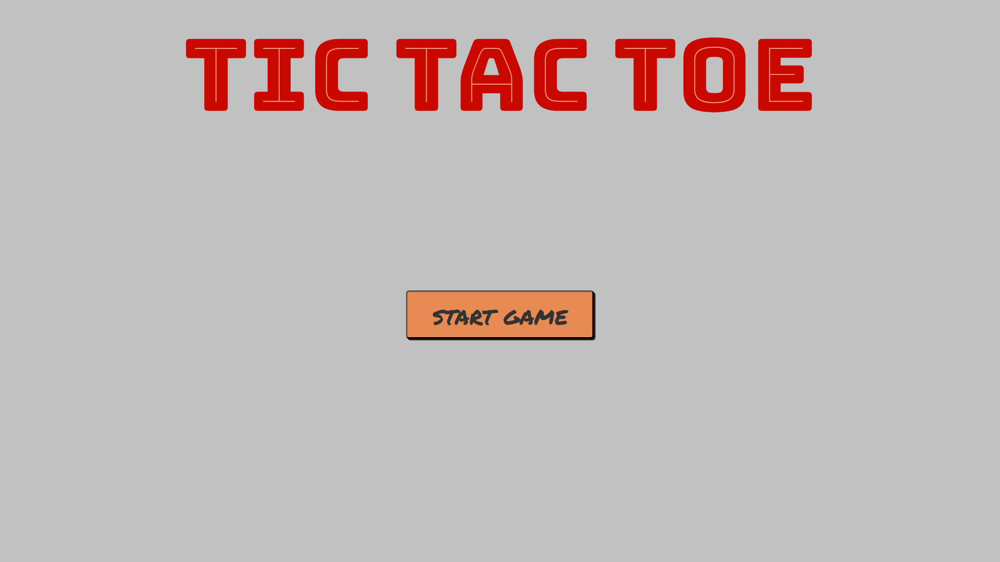

This is a simple implementation of the game using vanilla javascript ( even though I actually used typescript).

This project focuses on core concepts of DOM manipulation and event handling.

How to run locally
```sh
git clone https://github.com/walid-hud/tic-tac-toe.git
cd tic-tac-toe
npm i
npm run dev
```
I used typescript but you can find the js version [here](https://github.com/walid-hud/tic-tac-toe/blob/main/dist-js/main.js)
